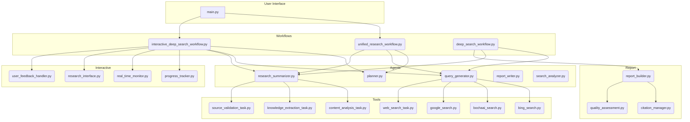
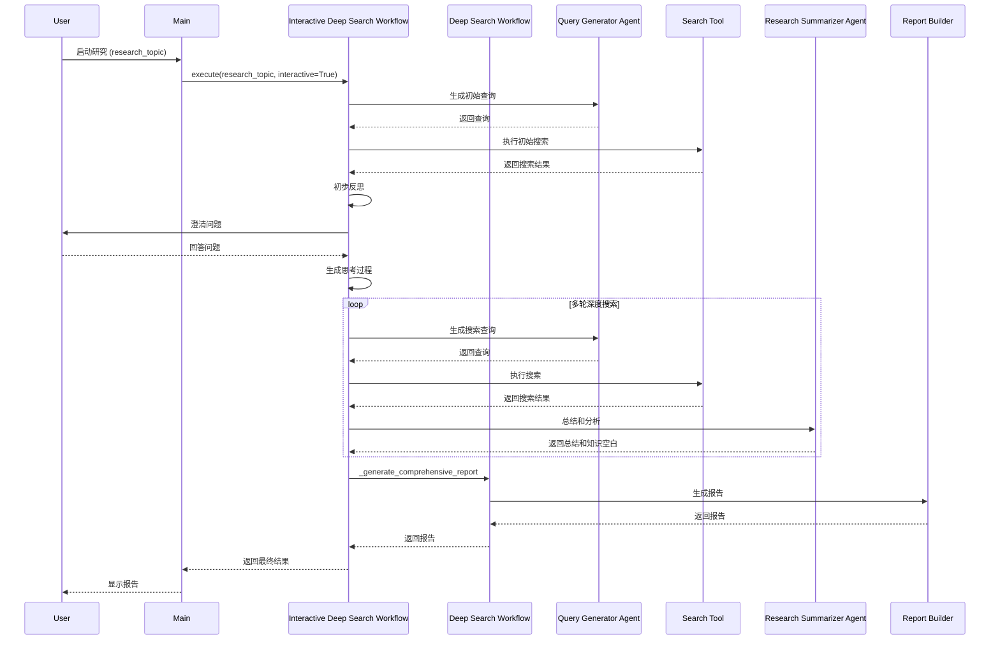

# AgenticX 深度搜索系统

一个基于 AgenticX 框架构建的智能研究助手，支持多种工作流模式，能够进行深度的网络搜索和知识发现。

## 🎯 项目概述

本项目展示了如何使用 AgenticX 的核心组件构建一个完整的深度搜索系统，通过统一研究工作流、多智能体协作和智能反思机制，实现对复杂研究主题的深入分析。支持基础模式、交互式模式和高级模式三种工作流，满足不同场景的研究需求。

## 🌟 核心特性

### 统一研究工作流
- **基础模式 (Basic)**: 直接深度搜索，适合明确需求的快速研究
- **交互式模式 (Interactive)**: 先搜索后澄清，AI 辅助聚焦研究方向
- **高级模式 (Advanced)**: 多轮迭代研究，适合复杂主题的深度探索

### 智能体架构
- **查询生成智能体**: 基于研究主题和上下文生成高质量搜索查询
- **研究总结智能体**: 分析搜索结果并生成结构化的专业研究报告

### 搜索引擎支持
- **博查AI (BochaaI)**: 默认搜索引擎，支持中文优化
- **Bing Search**: 微软 Bing 搜索 API
- **Mock Search**: 测试和开发模式

### 现代化界面
- **Rich 终端界面**: 美观的彩色输出和进度显示
- **InquirerPy 交互**: 现代化的命令行交互体验
- **实时进度跟踪**: 可视化研究进度和状态变化
- **多格式输出**: 支持 Markdown 格式的结构化报告

### 高级功能
- **多轮反思机制**: 通过反思和迭代不断优化研究质量
- **智能澄清系统**: 自动生成澄清问题，精准定位研究焦点
- **内容安全检查**: 防止触发 API 内容过滤机制
- **错误恢复机制**: 智能重试和降级处理
- **性能监控**: 实时收集执行指标和成功率

## 🚀 最新改进：多组件报告生成系统

为了提供更深入、更全面的研究分析，我们对报告生成系统进行了重大升级。告别单一的简短报告，迎接一个多层次、结构化的综合报告体验。

### 主要亮点

- **多组件报告架构**: 系统现在会生成一份主报告和五份详细的子报告，涵盖研究的方方面面：
    - **执行摘要 (Executive Summary)**: 高度浓缩研究背景、核心发现和关键建议。
    - **详细分析 (Detailed Analysis)**: 对研究主题进行深入的、全方位的剖析。
    - **方法论报告 (Methodology Report)**: 透明地展示研究过程、数据来源和分析方法。
    - **发现报告 (Findings Report)**: 系统性地呈现所有重要发现，并提供数据支持。
    - **影响分析与建议 (Implications & Recommendations)**: 针对不同利益相关方，提供可行的行动建议。

- **报告内容深度增强**:
    - **改进前**: ~1,000-2,000字，信息概览。
    - **改进后**: **~8,000-12,000字**，提供决策支持级别的专业分析。

- **全新的输出结构**: 所有报告都会被整齐地组织起来，方便您查阅。
    ```
    output/
    ├── research_report_[topic]_[timestamp].md          # 综合主报告
    └── sub_reports/
        ├── [topic]_executive_summary_[timestamp].md    # 执行摘要
        ├── [topic]_detailed_analysis_[timestamp].md    # 详细分析
        ├── [topic]_methodology_[timestamp].md          # 方法论
        ├── [topic]_findings_[timestamp].md             # 发现报告
        └── [topic]_implications_[timestamp].md         # 影响分析与建议
    ```

- **无缝体验**: 您无需更改任何操作习惯。只需像往常一样运行研究，系统将自动生成全新的综合报告。

## 🏗️ 系统架构

本系统采用模块化、分层化的架构，确保了高度的内聚性和低耦合度，便于扩展和维护。



*   **用户界面 (`main.py`)**: 作为应用的入口，负责解析命令行参数并启动相应的工作流。
*   **工作流层 (`workflows/`)**: 负责编排整个研究过程。
    *   `unified_research_workflow.py`: 为不同的研究模式（基础、交互式、高级）提供统一的入口。
    *   `interactive_deep_search_workflow.py`: 管理交互式研究过程，包括用户澄清和反馈循环。
    *   `deep_search_workflow.py`: 实现核心的多轮反思性研究逻辑。
*   **智能体层 (`agents/`)**: 一组专门的AI智能体，每个智能体在研究过程中负责特定的任务。
    *   `planner.py`: 制定研究策略并识别知识空白。
    *   `query_generator.py`: 根据研究上下文生成相关的搜索查询。
    *   `research_summarizer.py`: 总结搜索结果并提取关键见解。
    *   `report_writer.py`: 生成最终的综合研究报告。
    *   `search_analyzer.py`: 分析搜索结果的质量和相关性。
*   **工具层 (`tools/`)**: 智能体用于与外部世界交互的一组工具，主要用于网络搜索。支持多种搜索引擎，如Google、Bing和BochaaI。
*   **交互层 (`interactive/`)**: 促进与用户实时交互的组件，包括进度跟踪、实时监控和用户反馈处理。
*   **报告层 (`report/`)**: 负责构建最终报告的模块，包括引文管理和质量评估。

### 工作流程

#### 核心交互流程



#### 基础模式 (Basic)
```
研究主题 → 生成查询 → 执行搜索 → 分析结果 → 生成报告
```

#### 交互式模式 (Interactive)
```
研究主题 → 初始搜索 → 反思分析 → 生成澄清问题
                                    ↓
用户回答 → 定向研究 → 深度分析 → 生成最终报告
```

#### 高级模式 (Advanced)
```
研究主题 → 多轮迭代循环 → 质量评估 → 收敛检查 → 最终报告
    ↑           ↓
    └── 反思优化 ←┘
```

## 🚀 快速开始

### 1. 环境准备

```bash
# 克隆项目
git clone <repository_url>
cd AgenticDeepResearcher

# 安装依赖
pip install -r requirements.txt

# 设置环境变量
# 复制环境变量模板
cp env_template.txt .env

# 编辑 .env 文件，设置以下变量：
# KIMI_API_KEY=your_kimi_api_key
# KIMI_API_BASE=https://api.moonshot.cn/v1
# BOCHAAI_API_KEY=your_bochaai_api_key  # 可选
```


### 2. 运行测试

```bash
# 运行所有测试
python run_tests.py

# 或单独运行测试
pytest tests/ -v
```

### 3. 运行示例

#### 交互式模式（推荐）
```bash
python main.py
```

#### 命令行模式
```bash
# 基础模式
python main.py "ChatGPT 对教育行业的影响" --mode basic

# 交互式模式
python main.py "人工智能发展趋势" --mode interactive

# 高级模式
python main.py "区块链技术应用" --mode advanced --max_research_loops 3
```

#### 示例研究主题
- "ChatGPT 对教育行业的影响"
- "Tesla 最新的自动驾驶技术发展"
- "2024年人工智能发展趋势"
- "量子计算的商业化前景"
- "可持续能源技术创新"

### 4. 示例输出

```
 █████╗  ██████╗ ███████╗███╗   ██╗████████╗██╗ ██████╗██╗  ██╗
██╔══██╗██╔════╝ ██╔════╝████╗  ██║╚══██╔══╝██║██╔════╝╚██╗██╔╝
███████║██║  ███╗█████╗  ██╔██╗ ██║   ██║   ██║██║      ╚███╔╝ 
██╔══██║██║   ██║██╔══╝  ██║╚██╗██║   ██║   ██║██║      ██╔██╗ 
██║  ██║╚██████╔╝███████╗██║ ╚████║   ██║   ██║╚██████╗██╔╝ ██╗
╚═╝  ╚═╝ ╚═════╝ ╚══════╝╚═╝  ╚═══╝   ╚═╝   ╚═╝ ╚═════╝╚═╝  ╚═╝

● Quick Commands:
  ⎿  /help for help, /clear to clear
  ⎿  /exit to quit, /mode to select mode

● Environment Configuration:
  ⎿  API Key: sk-***...
  ⎿  API Base: https://api.moonshot.cn/v1
  ⎿  Search Engine: bochaai
  ⎿  Working Directory: /path/to/project

● Select research strategy:
  > Basic Mode - Direct deep search
    Interactive Mode - Search then clarify
    Advanced Mode - Multi-round iteration

● Type your research topic: ChatGPT 对教育行业的影响

● 开始执行基础模式研究工作流...
● 正在生成搜索查询...
● 执行搜索: ChatGPT教育应用现状与影响分析
● 正在分析搜索结果...
● 正在生成研究报告...
● 正在生成子报告: 执行摘要...
● 正在生成子报告: 详细分析...
● 正在生成子报告: 方法论报告...
● 正在生成子报告: 发现报告...
● 正在生成子报告: 影响分析与建议...
● 正在整合所有报告...
● Deep Search Completed Successfully! 🎉

📊 Research Report (Comprehensive)
┌─────────────────────────────────────────────────────────────┐
│ # ChatGPT 对教育行业的影响 - 深度研究报告                    │
│                                                             │
│ ## 1. 执行摘要                                              │
│ 本报告旨在深入探讨ChatGPT对教育行业的深远影响...            │
│                                                             │
│ ## 2. 详细分析                                              │
│ ChatGPT正在重塑教育的多个方面，从个性化学习路径...          │
│                                                             │
│ ## ... (其他部分)                                           │
│                                                             │
│ ## 结论                                                     │
│ ChatGPT为教育领域带来了前所未有的机遇...                    │
└─────────────────────────────────────────────────────────────┘

📄 Sub-reports have been saved to the `output/sub_reports` directory.

Execution Metrics
┌──────────────────┬─────────┐
│ Metric           │   Value │
├──────────────────┼─────────┤
│ Total Time       │  85.67s │
│ Search Count     │       5 │
│ Report Components│       6 │
│ Success Rate     │ 100.00% │
└──────────────────┴─────────┘

● Research completed! ✨
```

## 📁 项目结构

```
AgenticDeepResearcher/
├── .vscode/                   # VS Code 配置
├── agents/                    # 智能体定义
│   ├── __init__.py
│   ├── query_generator.py     # 查询生成智能体
│   └── research_summarizer.py # 研究总结智能体
├── interactive/               # 交互组件
│   └── __init__.py
├── report/                    # 报告生成
│   └── __init__.py
├── tests/                     # 测试文件
│   ├── __init__.py
│   ├── test_agents.py
│   ├── test_tools.py
│   └── test_workflows.py
├── thirdparty/               # 第三方集成
│   ├── __init__.py
│   ├── kimi_provider.py      # Kimi LLM 提供者
│   └── litellm_provider.py   # LiteLLM 提供者
├── tools/                    # 工具实现
│   ├── __init__.py
│   ├── bochaai_search.py     # 博查AI搜索工具
│   ├── bing_search.py        # Bing搜索工具
│   └── mock_search.py        # 模拟搜索工具
├── workflows/                # 工作流定义
│   ├── __init__.py
│   └── unified_research_workflow.py # 统一研究工作流
├── main.py                   # 应用入口
├── models.py                 # 数据模型
├── utils.py                  # 工具函数
├── config.yaml              # 配置文件
├── env_template.txt         # 环境变量模板
├── requirements.txt         # 依赖包
├── README.md                # 项目文档
├── API.md                   # API 文档
├── DEVELOPMENT.md           # 开发指南
```

## ⚙️ 配置说明

### 环境变量

| 变量名 | 说明 | 必需 | 默认值 |
|--------|------|------|--------|
| `KIMI_API_KEY` | Kimi API 密钥 | 是 | - |
| `KIMI_API_BASE` | Kimi API 基础URL | 否 | https://api.moonshot.cn/v1 |
| `BOCHAAI_API_KEY` | 博查AI API 密钥 | 否 | - |
| `BING_SUBSCRIPTION_KEY` | Bing Search API 密钥 | 否 | - |
| `GOOGLE_API_KEY` | Google Search API 密钥 | 否 | - |

### 配置文件 (config.yaml)

主要配置项：
- `llm.provider`: LLM 提供者 (默认: "kimi")
- `llm.model`: 模型名称 (默认: "kimi-k2-0711-preview")
- `search.provider`: 搜索引擎 (默认: "bochaai")
- `deep_search.max_research_loops`: 最大研究循环次数 (默认: 1)
- `deep_search.max_search_results`: 每次搜索的最大结果数 (默认: 2)

### 快速配置表

| 使用场景 | 环境变量配置 |
|----------|-------------|
| 基础配置 (推荐) | `KIMI_API_KEY=your_kimi_key` |
| 使用博查AI搜索 | `KIMI_API_KEY=your_key`<br>`BOCHAAI_API_KEY=your_bochaai_key` |
| 使用Bing搜索 | `KIMI_API_KEY=your_key`<br>`BING_SUBSCRIPTION_KEY=your_bing_key` |
| 开发测试模式 | `KIMI_API_KEY=your_key`<br>(使用 mock 搜索引擎) |

## 🔧 自定义扩展

### 添加新的搜索工具

```python
# tools/custom_search.py
from agenticx.core.tool import BaseTool
from models import SearchInput, SearchResult

class CustomSearchTool(BaseTool):
    def __init__(self, api_key: str):
        super().__init__(
            name="custom_search_tool",
            description="Custom Search API tool",
            args_schema=SearchInput
        )
        self.api_key = api_key
    
    def execute(self, query: str) -> SearchResult:
        # 实现自定义搜索逻辑
        results = self._perform_search(query)
        return SearchResult(
            query=query,
            results=results,
            total_results=len(results)
        )
```

### 扩展工作流模式

```python
# workflows/custom_workflow.py
from workflows.unified_research_workflow import UnifiedResearchWorkflow, WorkflowMode

class CustomWorkflowMode(WorkflowMode):
    EXPERT = "expert"  # 专家模式

class ExpertResearchWorkflow(UnifiedResearchWorkflow):
    def _execute_expert_mode(self, topic: str) -> Dict[str, Any]:
        # 实现专家模式逻辑
        pass
```

### 自定义LLM提供者

```python
# thirdparty/custom_provider.py
from agenticx.llms.base import BaseLLMProvider

class CustomLLMProvider(BaseLLMProvider):
    def __init__(self, api_key: str, model: str):
        super().__init__()
        self.api_key = api_key
        self.model = model
    
    def generate(self, prompt: str, **kwargs) -> str:
        # 实现自定义LLM调用逻辑
        pass
```

## 🤝 技术特色

| 特性 | 实现方式 | 优势 |
|------|----------|-------|
| 统一工作流 | 单一类支持多种模式 | 代码复用，易于维护 |
| 模块化设计 | 智能体、工具、工作流分离 | 高扩展性，易于测试 |
| 现代化界面 | Rich + InquirerPy | 美观的用户体验 |
| 错误恢复 | 多层次重试机制 | 高可靠性 |
| 性能监控 | 实时指标收集 | 可观测性强 |
| 配置驱动 | YAML配置文件 | 灵活的参数调整 |

## 📊 性能指标

- **平均执行时间**: 30-120 秒（取决于查询复杂度和模式）
- **搜索轮次**: 基础模式 1 轮，交互式模式 1-2 轮，高级模式 1-3 轮
- **Token 使用量**: 约 2000-6000 tokens
- **准确率**: 基于多搜索引擎的高质量结果
- **监控指标**: 实时收集执行时间、搜索次数、成功率、质量分数等
- **错误处理**: 多层重试机制，成功率 > 90%
- **内容安全**: 自动检测和处理敏感内容，避免API过滤

## 🐛 故障排除

### 常见问题

1. **API 密钥错误**: 检查 `.env` 文件中的 `KIMI_API_KEY` 设置
2. **内容过滤错误**: Kimi API 拒绝请求，尝试调整研究主题或使用其他模式
3. **搜索失败**: 检查搜索引擎配置和API密钥
4. **JSON 解析错误**: LLM 返回格式问题，系统会自动重试和修复
5. **连接超时**: 检查网络连接，配置文件中已设置较长超时时间


### 调试模式

```bash
# 启用详细输出
python main.py --verbose

# 查看配置信息
python -c "import yaml; print(yaml.safe_load(open('config.yaml')))"

# 测试环境变量
python -c "import os; print('KIMI_API_KEY:', os.getenv('KIMI_API_KEY', 'Not set'))"
```

### 测试和验证

```bash
# 运行测试套件
python -m pytest tests/ -v

# 测试特定组件
python -m pytest tests/test_workflows.py -v

# 使用Mock模式测试
# 在 config.yaml 中设置 search.provider: "mock"
python main.py "测试主题" --mode basic
```

## 📜 许可证

本项目采用 MIT 许可证，详见 [LICENSE](../../LICENSE) 文件。