# AgenticX 深度搜索系统

一个基于 AgenticX 框架构建的智能研究助手，支持多种工作流模式，能够进行深度的网络搜索和知识发现。

## 🎯 项目概述

本项目展示了如何使用 AgenticX 的核心组件构建一个完整的深度搜索系统，通过统一研究工作流、多智能体协作和智能反思机制，实现对复杂研究主题的深入分析。支持基础模式、交互式模式和高级模式三种工作流，满足不同场景的研究需求。

## 🌟 核心特性

### 统一研究工作流
- **基础模式 (Basic)**: 直接深度搜索，适合明确需求的快速研究
- **交互式模式 (Interactive)**: 先搜索后澄清，AI 辅助聚焦研究方向
- **高级模式 (Advanced)**: 多轮迭代研究，适合复杂主题的深度探索

### 智能体架构
- **查询生成智能体**: 基于研究主题和上下文生成高质量搜索查询
- **研究总结智能体**: 分析搜索结果并生成结构化的专业研究报告

### 搜索引擎支持
- **博查AI (BochaaI)**: 默认搜索引擎，支持中文优化
- **Bing Search**: 微软 Bing 搜索 API
- **Mock Search**: 测试和开发模式

### 现代化界面
- **Rich 终端界面**: 美观的彩色输出和进度显示
- **InquirerPy 交互**: 现代化的命令行交互体验
- **实时进度跟踪**: 可视化研究进度和状态变化
- **多格式输出**: 支持 Markdown 格式的结构化报告

### 高级功能
- **多轮反思机制**: 通过反思和迭代不断优化研究质量
- **智能澄清系统**: 自动生成澄清问题，精准定位研究焦点
- **内容安全检查**: 防止触发 API 内容过滤机制
- **错误恢复机制**: 智能重试和降级处理
- **性能监控**: 实时收集执行指标和成功率

## 🚀 最新改进：多组件报告生成系统

为了提供更深入、更全面的研究分析，我们对报告生成系统进行了重大升级。告别单一的简短报告，迎接一个多层次、结构化的综合报告体验。

### 主要亮点

- **多组件报告架构**: 系统现在会生成一份主报告和五份详细的子报告，涵盖研究的方方面面：
    - **执行摘要 (Executive Summary)**: 高度浓缩研究背景、核心发现和关键建议。
    - **详细分析 (Detailed Analysis)**: 对研究主题进行深入的、全方位的剖析。
    - **方法论报告 (Methodology Report)**: 透明地展示研究过程、数据来源和分析方法。
    - **发现报告 (Findings Report)**: 系统性地呈现所有重要发现，并提供数据支持。
    - **影响分析与建议 (Implications & Recommendations)**: 针对不同利益相关方，提供可行的行动建议。

- **报告内容深度增强**:
    - **改进前**: ~1,000-2,000字，信息概览。
    - **改进后**: **~8,000-12,000字**，提供决策支持级别的专业分析。

- **全新的输出结构**: 所有报告都会被整齐地组织起来，方便您查阅。
    ```
    output/
    ├── research_report_[topic]_[timestamp].md          # 综合主报告
    └── sub_reports/
        ├── [topic]_executive_summary_[timestamp].md    # 执行摘要
        ├── [topic]_detailed_analysis_[timestamp].md    # 详细分析
        ├── [topic]_methodology_[timestamp].md          # 方法论
        ├── [topic]_findings_[timestamp].md             # 发现报告
        └── [topic]_implications_[timestamp].md         # 影响分析与建议
    ```

- **无缝体验**: 您无需更改任何操作习惯。只需像往常一样运行研究，系统将自动生成全新的综合报告。

## 🏗️ 系统架构

本系统采用模块化、分层化的架构，确保了高度的内聚性和低耦合度，便于扩展和维护。


*   **用户界面 (`main.py`)**: 作为应用的入口，负责解析命令行参数并启动相应的工作流。
*   **工作流层 (`workflows/`)**: 负责编排整个研究过程。
    *   `unified_research_workflow.py`: 为不同的研究模式（基础、交互式、高级）提供统一的入口。
    *   `interactive_deep_search_workflow.py`: 管理交互式研究过程，包括用户澄清和反馈循环。
    *   `deep_search_workflow.py`: 实现核心的多轮反思性研究逻辑。
*   **智能体层 (`agents/`)**: 一组专门的AI智能体，每个智能体在研究过程中负责特定的任务。
    *   `planner.py`: 制定研究策略并识别知识空白。
    *   `query_generator.py`: 根据研究上下文生成相关的搜索查询。
    *   `research_summarizer.py`: 总结搜索结果并提取关键见解。
    *   `report_writer.py`: 生成最终的综合研究报告。
    *   `search_analyzer.py`: 分析搜索结果的质量和相关性。
*   **工具层 (`tools/`)**: 智能体用于与外部世界交互的一组工具，主要用于网络搜索。支持多种搜索引擎，如Google、Bing和BochaaI。
*   **交互层 (`interactive/`)**: 促进与用户实时交互的组件，包括进度跟踪、实时监控和用户反馈处理。
*   **报告层 (`report/`)**: 负责构建最终报告的模块，包括引文管理和质量评估。

### 工作流程

#### 核心交互流程

```mermaid
sequenceDiagram
    participant User
    participant Main
    participant InteractiveWorkflow as Interactive Deep Search Workflow
    participant DeepWorkflow as Deep Search Workflow
    participant QueryGenerator as Query Generator Agent
    participant SearchTool as Search Tool
    participant Summarizer as Research Summarizer Agent
    participant ReportBuilder as Report Builder

    User->>Main: 启动研究 (research_topic)
    Main->>InteractiveWorkflow: execute(research_topic, interactive=True)
    InteractiveWorkflow->>QueryGenerator: 生成初始查询
    QueryGenerator-->>InteractiveWorkflow: 返回查询
    InteractiveWorkflow->>SearchTool: 执行初始搜索
    SearchTool-->>InteractiveWorkflow: 返回搜索结果
    InteractiveWorkflow->>InteractiveWorkflow: 初步反思
    InteractiveWorkflow->>User: 澄清问题
    User-->>InteractiveWorkflow: 回答问题
    InteractiveWorkflow->>InteractiveWorkflow: 生成思考过程
    loop 多轮深度搜索
        InteractiveWorkflow->>QueryGenerator: 生成搜索查询
        QueryGenerator-->>InteractiveWorkflow: 返回查询
        InteractiveWorkflow->>SearchTool: 执行搜索
        SearchTool-->>InteractiveWorkflow: 返回搜索结果
        InteractiveWorkflow->>Summarizer: 总结和分析
        Summarizer-->>InteractiveWorkflow: 返回总结和知识空白
    end
    InteractiveWorkflow->>DeepWorkflow: _generate_comprehensive_report
    DeepWorkflow->>ReportBuilder: 生成报告
    ReportBuilder-->>DeepWorkflow: 返回报告
    DeepWorkflow-->>InteractiveWorkflow: 返回报告
    InteractiveWorkflow-->>Main: 返回最终结果
    Main-->>User: 显示报告
```



#### 基础模式 (Basic)
```
研究主题 → 生成查询 → 执行搜索 → 分析结果 → 生成报告
```

#### 交互式模式 (Interactive)
```
研究主题 → 初始搜索 → 反思分析 → 生成澄清问题
                                    ↓
用户回答 → 定向研究 → 深度分析 → 生成最终报告
```

#### 高级模式 (Advanced)
```
研究主题 → 多轮迭代循环 → 质量评估 → 收敛检查 → 最终报告
    ↑           ↓
    └── 反思优化 ←┘
```

## 🚀 快速开始

### 1. 环境准备

```bash
# 克隆项目
git clone <repository_url>
cd AgenticDeepResearcher

# 安装依赖
pip install -r requirements.txt

# 设置环境变量
# 复制环境变量模板
cp env_template.txt .env

# 编辑 .env 文件，设置以下变量：
# KIMI_API_KEY=your_kimi_api_key
# KIMI_API_BASE=https://api.moonshot.cn/v1
# BOCHAAI_API_KEY=your_bochaai_api_key  # 可选
```

> 📋 **详细的环境变量设置指南，请参考 [ENV_SETUP.md](./ENV_SETUP.md)**

### 2. 运行测试

```bash
# 运行所有测试
python run_tests.py

# 或单独运行测试
pytest tests/ -v
```

### 3. 运行示例

#### 交互式模式（推荐）
```bash
python main.py
```

#### 命令行模式
```bash
# 基础模式
python main.py "ChatGPT 对教育行业的影响" --mode basic

# 交互式模式
python main.py "人工智能发展趋势" --mode interactive

# 高级模式
python main.py "区块链技术应用" --mode advanced --max_research_loops 3
```

#### 示例研究主题
- "ChatGPT 对教育行业的影响"
- "Tesla 最新的自动驾驶技术发展"
- "2024年人工智能发展趋势"
- "量子计算的商业化前景"
- "可持续能源技术创新"

### 4. 示例输出

```
 █████╗  ██████╗ ███████╗███╗   ██╗████████╗██╗ ██████╗██╗  ██╗
██╔══██╗██╔════╝ ██╔════╝████╗  ██║╚══██╔══╝██║██╔════╝╚██╗██╔╝
███████║██║  ███╗█████╗  ██╔██╗ ██║   ██║   ██║██║      ╚███╔╝
██╔══██║██║   ██║██╔══╝  ██║╚██╗██║   ██║   ██║██║      ██╔██╗ 
██║  ██║╚██████╔╝███████╗██║ ╚████║   ██║   ██║╚██████╗██╔╝ ██╗
╚═╝  ╚═╝ ╚═════╝ ╚══════╝╚═╝  ╚═══╝   ╚═╝   ╚═╝ ╚═════╝╚═╝  ╚═╝

● Quick Commands:
  ⎿  /help for help, /clear to clear
  ⎿  /exit to quit, /mode to select mode

● Environment Configuration:
  ⎿  API Key: sk-***...
  ⎿  API Base: https://api.moonshot.cn/v1
  ⎿  Search Engine: bochaai
  ⎿  Working Directory: /path/to/project

● Select research strategy:
  > Basic Mode - Direct deep search
    Interactive Mode - Search then clarify
    Advanced Mode - Multi-round iteration

● Type your research topic: ChatGPT 对教育行业的影响

● 开始执行基础模式研究工作流...
● 正在生成搜索查询...
● 执行搜索: ChatGPT教育应用现状与影响分析
● 正在分析搜索结果...
● 正在生成研究报告...
● 正在生成子报告: 执行摘要...
● 正在生成子报告: 详细分析...
● 正在生成子报告: 方法论报告...
● 正在生成子报告: 发现报告...
● 正在生成子报告: 影响分析与建议...
● 正在整合所有报告...
● Deep Search Completed Successfully! 🎉

📊 Research Report (Comprehensive)
┌─────────────────────────────────────────────────────────────┐
│ # ChatGPT 对教育行业的影响 - 深度研究报告                    │
│                                                             │
│ ## 1. 执行摘要                                              │
│ 本报告旨在深入探讨ChatGPT对教育行业的深远影响...            │
│                                                             │
│ ## 2. 详细分析                                              │
│ ChatGPT正在重塑教育的多个方面，从个性化学习路径...          │
│                                                             │
│ ## ... (其他部分)                                           │
│                                                             │
│ ## 结论                                                     │
│ ChatGPT为教育领域带来了前所未有的机遇...                    │
└─────────────────────────────────────────────────────────────┘

📄 Sub-reports have been saved to the `output/sub_reports` directory.

Execution Metrics
┌──────────────────┬─────────┐
│ Metric           │   Value │
├──────────────────┼─────────┤
│ Total Time       │  85.67s │
│ Search Count     │       5 │
│ Report Components│       6 │
│ Success Rate     │ 100.00% │
└──────────────────┴─────────┘

● Research completed! ✨
```

## 📁 项目结构

```
AgenticDeepResearcher/
├── .vscode/                   # VS Code 配置
├── agents/                    # 智能体定义
│   ├── __init__.py
│   ├── query_generator.py     # 查询生成智能体
│   └── research_summarizer.py # 研究总结智能体
├── interactive/               # 交互组件
│   └── __init__.py
├── report/                    # 报告生成
│   └── __init__.py
├── tests/                     # 测试文件
│   ├── __init__.py
│   ├── test_agents.py
│   ├── test_tools.py
│   └── test_workflows.py
├── thirdparty/               # 第三方集成
│   ├── __init__.py
│   ├── kimi_provider.py      # Kimi LLM 提供者
│   └── litellm_provider.py   # LiteLLM 提供者
├── tools/                    # 工具实现
│   ├── __init__.py
│   ├── bochaai_search.py     # 博查AI搜索工具
│   ├── bing_search.py        # Bing搜索工具
│   └── mock_search.py        # 模拟搜索工具
├── workflows/                # 工作流定义
│   ├── __init__.py
│   └── unified_research_workflow.py # 统一研究工作流
├── main.py                   # 应用入口
├── models.py                 # 数据模型
├── utils.py                  # 工具函数
├── config.yaml              # 配置文件
├── env_template.txt         # 环境变量模板
├── requirements.txt         # 依赖包
├── README.md                # 项目文档
├── API.md                   # API 文档
├── DEVELOPMENT.md           # 开发指南
└── ENV_SETUP.md             # 环境设置指南
```

## ⚙️ 配置说明

### 环境变量

| 变量名 | 说明 | 必需 | 默认值 |
|--------|------|------|--------|
| `KIMI_API_KEY` | Kimi API 密钥 | 是 | - |
| `KIMI_API_BASE` | Kimi API 基础URL | 否 | https://api.moonshot.cn/v1 |
| `BOCHAAI_API_KEY` | 博查AI API 密钥 | 否 | - |
| `BING_SUBSCRIPTION_KEY` | Bing Search API 密钥 | 否 | - |
| `GOOGLE_API_KEY` | Google Search API 密钥 | 否 | - |

### 配置文件 (config.yaml)

主要配置项：
- `llm.provider`: LLM 提供者 (默认: "kimi")
- `llm.model`: 模型名称 (默认: "kimi-k2-0711-preview")
- `search.provider`: 搜索引擎 (默认: "bochaai")
- `deep_search.max_research_loops`: 最大研究循环次数 (默认: 1)
- `deep_search.max_search_results`: 每次搜索的最大结果数 (默认: 2)

### 快速配置表

| 使用场景 | 环境变量配置 |
|----------|-------------|
| 基础配置 (推荐) | `KIMI_API_KEY=your_kimi_key` |
| 使用博查AI搜索 | `KIMI_API_KEY=your_key`<br>`BOCHAAI_API_KEY=your_bochaai_key` |
| 使用Bing搜索 | `KIMI_API_KEY=your_key`<br>`BING_SUBSCRIPTION_KEY=your_bing_key` |
| 开发测试模式 | `KIMI_API_KEY=your_key`<br>(使用 mock 搜索引擎) |

## 🔧 自定义扩展

### 添加新的搜索工具

```python
# tools/custom_search.py
from agenticx.core.tool import BaseTool
from models import SearchInput, SearchResult

class CustomSearchTool(BaseTool):
    def __init__(self, api_key: str):
        super().__init__(
            name="custom_search_tool",
            description="Custom Search API tool",
            args_schema=SearchInput
        )
        self.api_key = api_key
    
    def execute(self, query: str) -> SearchResult:
        # 实现自定义搜索逻辑
        results = self._perform_search(query)
        return SearchResult(
            query=query,
            results=results,
            total_results=len(results)
        )
```

### 扩展工作流模式

```python
# workflows/custom_workflow.py
from workflows.unified_research_workflow import UnifiedResearchWorkflow, WorkflowMode

class CustomWorkflowMode(WorkflowMode):
    EXPERT = "expert"  # 专家模式

class ExpertResearchWorkflow(UnifiedResearchWorkflow):
    def _execute_expert_mode(self, topic: str) -> Dict[str, Any]:
        # 实现专家模式逻辑
        pass
```

### 自定义LLM提供者

```python
# thirdparty/custom_provider.py
from agenticx.llms.base import BaseLLMProvider

class CustomLLMProvider(BaseLLMProvider):
    def __init__(self, api_key: str, model: str):
        super().__init__()
        self.api_key = api_key
        self.model = model
    
    def generate(self, prompt: str, **kwargs) -> str:
        # 实现自定义LLM调用逻辑
        pass
```

## 🤝 技术特色

| 特性 | 实现方式 | 优势 |
|------|----------|-------|
| 统一工作流 | 单一类支持多种模式 | 代码复用，易于维护 |
| 模块化设计 | 智能体、工具、工作流分离 | 高扩展性，易于测试 |
| 现代化界面 | Rich + InquirerPy | 美观的用户体验 |
| 错误恢复 | 多层次重试机制 | 高可靠性 |
| 性能监控 | 实时指标收集 | 可观测性强 |
| 配置驱动 | YAML配置文件 | 灵活的参数调整 |

## 📊 性能指标

- **平均执行时间**: 30-120 秒（取决于查询复杂度和模式）
- **搜索轮次**: 基础模式 1 轮，交互式模式 1-2 轮，高级模式 1-3 轮
- **Token 使用量**: 约 2000-6000 tokens
- **准确率**: 基于多搜索引擎的高质量结果
- **监控指标**: 实时收集执行时间、搜索次数、成功率、质量分数等
- **错误处理**: 多层重试机制，成功率 > 90%
- **内容安全**: 自动检测和处理敏感内容，避免API过滤

## 🐛 故障排除

### 常见问题

1. **API 密钥错误**: 检查 `.env` 文件中的 `KIMI_API_KEY` 设置
2. **内容过滤错误**: Kimi API 拒绝请求，尝试调整研究主题或使用其他模式
3. **搜索失败**: 检查搜索引擎配置和API密钥
4. **JSON 解析错误**: LLM 返回格式问题，系统会自动重试和修复
5. **连接超时**: 检查网络连接，配置文件中已设置较长超时时间

> 🚨 **更多详细的故障排除方法，请参考 [ENV_SETUP.md](./ENV_SETUP.md#-故障排除)**

### 调试模式

```bash
# 启用详细输出
python main.py --verbose

# 查看配置信息
python -c "import yaml; print(yaml.safe_load(open('config.yaml')))"

# 测试环境变量
python -c "import os; print('KIMI_API_KEY:', os.getenv('KIMI_API_KEY', 'Not set'))"
```

### 测试和验证

```bash
# 运行测试套件
python -m pytest tests/ -v

# 测试特定组件
python -m pytest tests/test_workflows.py -v

# 使用Mock模式测试
# 在 config.yaml 中设置 search.provider: "mock"
python main.py "测试主题" --mode basic
```

## 📜 许可证

本项目采用 MIT 许可证，详见 [LICENSE](../../LICENSE) 文件。